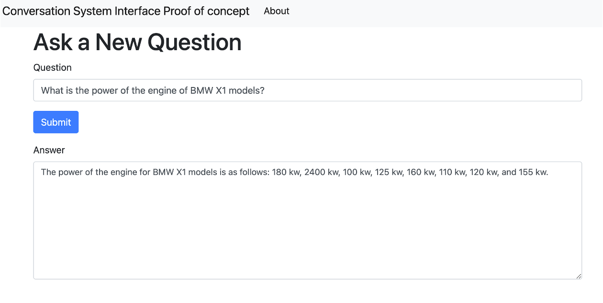

# knowledgeGraph-LLM-Conversational-system

This is a knowledge graph and LLM-based Conversational-system prototype that has no infers answers directly from a knowledge Graph.
This project is made in the context of the GPT-x project! 

This application includes a dockerized website and its server that showcases the usage of LLM and knowledge graphs together to present a hallucination-less conversation. 

The data used in the demo is scraped from BMW's automobile company's website. 

# requiements:
Setting the openAI API for GPT-4 key or changing main_openGptx.py to main.py to use OpenGpt-X 

### To run the application :

first, make the docker image:

docker build -t chatapi .

And run it like:

docker run -p 80:80 chatapi  

Then open the browser in

http://127.0.0.1:5000/
And  http://127.0.0.1:5000/chati 

#### Sample questions:
Here is a list of questions that can be used to test the system:

How many electric cars are available?
Which hybrid car emits the least CO2?
Which is the weakest car available?
What is tire pressure
What is my tire pressure
What is the cabin temperature
How is my air filter
How many kilometers are on this car
How many kilometers are left in this car
How much gas do I have left
How much power does the BMW X7 have?
How much power does the BMW X7 xDrive40i have?
How much does a BMW X7 cost?
What is the engine configuration of the BMW X7 M60i xDrive?
